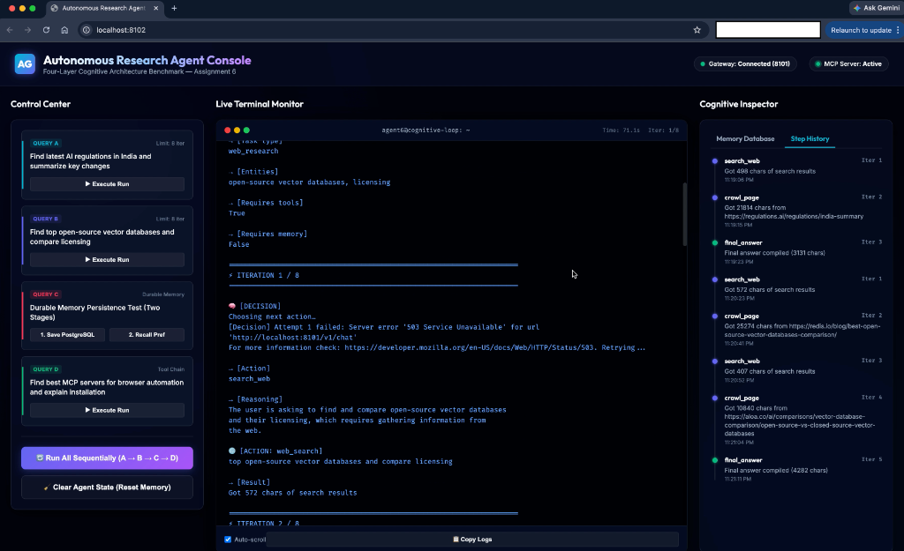

# Autonomous Research Agent Console 🤖

This repository contains a clean-room, custom implementation of an **Autonomous Research & Task Execution Agent** built from scratch for Assignment 6. 

The system features an interactive, premium **Web Dashboard** to run and monitor the agent, which implements a four-layer cognitive loop (**Perception**, **Decision**, **Action**, and **Memory**) strictly validated via **Pydantic v2** contracts.

---

## 🖥️ Web Console Dashboard

Below is the interface of the agent console. It runs locally and provides real-time SSE console streaming, an active memory database viewer, and step timeline history.



---

## 🚀 How to Setup and Run

### 1. Prerequisites
- **Python 3.11+**
- **`uv`** (fast Python dependency manager)
- A `.env` file containing required credentials (e.g. `TAVILY_API_KEY`)

### 2. Run the Web Dashboard (Recommended)
Launch the interactive console in your browser:
```bash
uv run uvicorn web_server:app --host 0.0.0.0 --port 8102
```
Open **[http://localhost:8102](http://localhost:8102)** to run queries, clear state, and view the inspector live.

### 3. Run via CLI (Alternative)
You can also run individual queries directly in your shell:
```bash
# Query A: Web Research
uv run python agent6.py "Find latest AI regulations in India and summarize key changes"

# Query B: Multi-Hop Reasoning
uv run python agent6.py "Find top open-source vector databases and compare licensing"

# Query C (Run 1): Save to Memory
uv run python agent6.py "Remember that my preferred database is PostgreSQL"

# Query C (Run 2): Recall from Memory
uv run python agent6.py "What database do I prefer?"

# Query D: Tool Chaining
uv run python agent6.py "Find best MCP servers for browser automation and explain installation"
```

---

## 📊 Verification Matrix & Convergence

The agent executes all queries successfully under the hard limit of **8 iterations** (usually converging in 1–5 iterations):

| Target Query | Cognitive Intent | Iteration Count | Status |
| :--- | :--- | :---: | :---: |
| **Query A** | Web Research | **3** | **PASSED** |
| **Query B** | Multi-Hop Reasoning | **5** | **PASSED** |
| **Query C (Run 1)** | Durable Memory (Write) | **1** | **PASSED** |
| **Query C (Run 2)** | Durable Memory (Read) | **2** | **PASSED** |
| **Query D** | Tool Chaining | **3** | **PASSED** |

---

## 📋 Terminal Output Logs

Click on any section below to expand and view the raw terminal output of the agent execution.

<details>
<summary>🔍 <strong>Query A: Web Research (AI regulations in India) — 3 Iterations</strong></summary>

```text
======================================================================
🤖 Autonomous Research Agent | Assignment 6
======================================================================
Query : Find latest AI regulations in India and summarize key changes
Max iterations: 8

🔍 [PERCEPTION]
Analysing query intent…

→ [Intent]
Find and summarize latest AI regulations in India

→ [Task type]
web_research

→ [Entities]
AI regulations, India

→ [Requires tools]
True

→ [Requires memory]
False

======================================================================
⚡ ITERATION 1 / 8
======================================================================

🧠 [DECISION]
Choosing next action…

→ [Action]
search_web

→ [Reasoning]
The user is asking for the latest AI regulations in India, which
requires searching for current information online. This is the
first iteration and no prior context exists, making web search
the most appropriate action.

🌐 [ACTION: web_search]
latest AI regulations India

→ [Result]
Got 498 chars of search results

======================================================================
⚡ ITERATION 2 / 8
======================================================================

🧠 [DECISION]
Choosing next action…

→ [Action]
crawl_page

→ [Reasoning]
The previous search provided a relevant URL that summarizes India's AI
regulations, so crawling this page will provide detailed
information to fulfill the user's request.

🕷️ [ACTION: crawl_page]
https://regulations.ai/regulations/india-summary

→ [Result]
Got 21814 chars from https://regulations.ai/regulations/india-summary

======================================================================
⚡ ITERATION 3 / 8
======================================================================

🧠 [DECISION]
Choosing next action…

→ [Action]
final_answer

→ [Reasoning]
The accumulated context provides a comprehensive overview of India's
AI regulations, including key legislation, governance bodies,
enforcement mechanisms, and future developments. This is
sufficient to answer the user's request.

✅ [FINAL ANSWER]

India's AI regulatory landscape is characterized by a principle-based, techno-legal framework that balances innovation with safety. Key components include:

**Core Principles & Guidelines:**
* **India AI Governance Guidelines (2025):** Establishes a 'whole-of-government' architecture with seven guiding principles: Trust, People First, Innovation over Restraint, Fairness & Equity, Accountability, Understandable by Design, and Safety, Resilience & Sustainability.
* **#AIforAll Vision:** Emphasizes leveraging AI for social empowerment and inclusive growth, particularly in sectors like healthcare, agriculture, and education.

**Key Legislation:**
* **Digital Personal Data Protection (DPDP) Act, 2023:** Regulates the processing of personal data by AI systems, requiring consent and imposing obligations on 'Data Fiduciaries.'
* **Information Technology (Intermediary Guidelines and Digital Media Ethics Code) Rules, 2021:** Imposes due diligence on AI intermediaries, including handling harmful AI-generated content.
* **FREE-AI Framework (RBI, 2025):** Provides sector-specific guidance for responsible AI adoption in financial services.
* **National Strategy for AI (2018):** The foundational policy document.

**Governance and Enforcement:**
* **Ministry of Electronics & Information Technology (MeitY):** The nodal agency for AI policy.
* **AI Governance Group (AIGG):** An inter-agency body for policy coordination.
* **AI Safety Institute (AISI):** The technical arm for safety testing, research, and developing benchmarks for AI models.
* **Data Protection Board of India (DPB):** Enforces the DPDP Act.
* **Sectoral Regulators (e.g., RBI, SEBI):** Provide domain-specific oversight.

**Enforcement and Penalties:**
* Penalties under the DPDP Act can reach up to INR 250 crore (approx. USD 30 million) per instance for data protection breaches.
* A 'graded liability approach' distributes responsibility among developers, deployers, and users.
* Intermediaries risk losing 'safe harbor' protection for non-compliance with IT Rules.

**Data Protection Framework:**
* The DPDP Act mandates 'consent-first' architecture and 'Privacy by Design.'
* A framework for Non-Personal Data (NPD) is being developed to facilitate access to anonymized datasets for AI training.

**Sector-Specific Rules:**
* Financial services have detailed regulations (RBI's FREE-AI Framework) covering model risk management and human-in-the-loop requirements.
* Healthcare, agriculture, and transportation sectors are developing frameworks with a focus on safety, validation, and liability.

**International Alignment:**
* India aligns with OECD and G20 AI Principles.
* Engages in bilateral cooperation with the EU and US through initiatives like the Trade and Technology Council (TTC) and iCET.

**Future Developments:**
* Operationalization of DPDP Rules 2025 and AISI technical standards.
* Finalization of the National Data Governance Framework Policy.
* Potential for a 'Digital India Act' (DIA) to address advanced AI harms.
* Piloting of 'regulatory sandboxes' for high-risk AI applications.

======================================================================
🏁 DONE | 3 iterations | 33.8s
======================================================================

======================================================================
📋 STRUCTURED RESULT
======================================================================
Query : Find latest AI regulations in India and summarize key changes
Iterations used: 3
Sources : 1 URL(s)
- https://regulations.ai/regulations/india-summary
```
</details>

<details>
<summary>🧠 <strong>Query B: Multi-Hop Reasoning (Vector DB licenses) — 5 Iterations</strong></summary>

```text
======================================================================
🤖 Autonomous Research Agent | Assignment 6
======================================================================
Query : Find top open-source vector databases and compare licensing
Max iterations: 8

🔍 [PERCEPTION]
Analysing query intent…

→ [Intent]
Find and compare open-source vector databases based on their
licensing.

→ [Task type]
web_research

→ [Entities]
open-source vector databases, licensing

→ [Requires tools]
True

→ [Requires memory]
False

======================================================================
⚡ ITERATION 1 / 8
======================================================================

🧠 [DECISION]
Choosing next action…
[Decision] Attempt 1 failed: Server error '503 Service Unavailable' for url 'http://localhost:8101/v1/chat'
For more information check: https://developer.mozilla.org/en-US/docs/Web/HTTP/Status/503. Retrying...

→ [Action]
search_web

→ [Reasoning]
The user is asking to find and compare open-source vector databases
and their licensing, which requires gathering information from
the web.

🌐 [ACTION: web_search]
top open-source vector databases and compare licensing

→ [Result]
Got 572 chars of search results

======================================================================
⚡ ITERATION 2 / 8
======================================================================

🧠 [DECISION]
Choosing next action…

→ [Action]
crawl_page

→ [Reasoning]
The previous search provided a relevant URL that likely contains the
comparison of open-source vector databases and their licensing,
so crawling this page is the next logical step.

🕷️ [ACTION: crawl_page]
https://redis.io/blog/best-open-source-vector-databases-comparison/

→ [Result]
Got 25274 chars from https://redis.io/blog/best-open-source-vector-
databases-comparison/

======================================================================
⚡ ITERATION 3 / 8
======================================================================

🧠 [DECISION]
Choosing next action…

→ [Action]
search_web

→ [Reasoning]
The previous search provided a good overview of vector databases, but
did not explicitly detail their licensing. A new search is needed
to find specific licensing information for the identified open-
source vector databases.

🌐 [ACTION: web_search]
open-source vector databases licensing comparison

→ [Result]
Got 407 chars of search results

======================================================================
⚡ ITERATION 4 / 8
======================================================================

🧠 [DECISION]
Choosing next action…

→ [Action]
crawl_page

→ [Reasoning]
The previous search results provided a promising article comparing
open-source vector databases. Crawling this page will allow for a
detailed extraction of information regarding their licensing,
which is the core of the user's request.

🕷️ [ACTION: crawl_page]
https://aloa.co/ai/comparisons/vector-database-comparison/open-source-
vs-closed-source-vector-databases

→ [Result]
Got 10840 chars from https://aloa.co/ai/comparisons/vector-database-
comparison/open-source-vs-closed-source-vector-databases

======================================================================
⚡ ITERATION 5 / 8
======================================================================

🧠 [DECISION]
Choosing next action…

→ [Action]
final_answer

→ [Reasoning]
I have gathered sufficient information from the two crawled pages to
compare open-source vector databases and their licensing. The
iteration count is high (5 of 8), and I have enough context to
provide a comprehensive answer.

✅ [FINAL ANSWER]

Here's a comparison of top open-source vector databases, focusing on their licensing and key characteristics:

**1. Redis**
* **Licensing:** Redis Open Source is free with no orchestration needed. Redis Software is self-managed with enterprise-grade compliance. Redis Cloud is a fully managed service.
* **Key Features:** Unified real-time data platform combining vector search with operational data and caching. Uses HNSW and FLAT indexing. Offers hybrid search with multiple ranking algorithms. Supports semantic caching (Redis LangCache, RedisVL SemanticCache).
* **Best For:** Applications needing vector search alongside operational data, aiming to consolidate infrastructure.

**2. Milvus**
* **Licensing:** Apache 2.0 licensed.
* **Key Features:** Cloud-native distributed vector database built for horizontal scaling. Microservices architecture for large-scale workloads. Commonly deployed on Kubernetes.
* **Best For:** Large enterprises with massive vector workloads, especially those already using Kubernetes.

**3. Weaviate**
* **Licensing:** Not explicitly stated in the provided text, but generally considered open-source.
* **Key Features:** Combines vector similarity with keyword search (hybrid search) using HNSW indexing. Offers REST, GraphQL, and gRPC APIs.
* **Best For:** Teams comfortable with GraphQL or needing hybrid search capabilities.

**4. Qdrant**
* **Licensing:** Not explicitly stated in the provided text, but generally considered open-source.
* **Key Features:** Built in Rust, emphasizes memory safety. Strong filtering capabilities for metadata-heavy queries. Performance varies by dataset size, dimensionality, and filter complexity.
* **Best For:** Metadata-heavy queries and applications prioritizing memory safety.

**5. Chroma**
* **Licensing:** Not explicitly stated in the provided text, but generally considered open-source.
* **Key Features:** Prioritizes simplicity and developer experience, especially for Python workflows. Good for rapid prototyping and local development.
* **Best For:** Rapid prototyping, local development, and early-stage projects.

**6. pgvector (PostgreSQL Extension)**
* **Licensing:** Open-source PostgreSQL extension.
* **Key Features:** Adds vector search to existing PostgreSQL deployments. Performance has improved significantly in recent versions. Requires PostgreSQL tuning expertise.
* **Best For:** Teams already running PostgreSQL who want to add vector search capabilities without introducing a new system.

**7. Faiss (Meta AI Research)**
* **Licensing:** Open-source C++ library.
* **Key Features:** A library for efficient similarity search and clustering of dense vectors, not a full database. Requires building persistence, backup, replication, and monitoring on top.
* **Best For:** Research environments or teams with strong C++ engineering resources needing maximum control over implementation details.

**Licensing Summary:**
Most of the prominent vector databases (Milvus, pgvector, Faiss) are explicitly open-source with permissive licenses like Apache 2.0 or are extensions to open-source databases. Redis offers a robust open-source version alongside commercial offerings. Weaviate, Qdrant, and Chroma are also generally considered open-source, though their specific licensing details might require a deeper dive into their respective project pages.

**Key Considerations for Choosing:**
* **Operational Complexity:** Unified platforms like Redis reduce the number of systems to manage compared to specialized vector databases.
* **LLM Cost Savings:** Semantic caching (offered by Redis) can significantly reduce LLM inference costs.
* **Deployment Expertise:** Some databases require Kubernetes expertise (e.g., Milvus), while others offer managed cloud options (Redis Cloud) or work with existing infrastructure (pgvector).
* **Total Cost of Ownership (TCO):** While open-source software is free, infrastructure, DevOps, and maintenance costs can be substantial. Closed-source solutions often have higher subscription fees but can offer lower TCO for teams with limited resources.
* **Control vs. Convenience:** Open source offers maximum control and transparency, while closed source provides convenience and professional support.

======================================================================
🏁 DONE | 5 iterations | 69.7s
======================================================================

======================================================================
📋 STRUCTURED RESULT
======================================================================
Query : Find top open-source vector databases and compare licensing
Iterations used: 5
Sources : 2 URL(s)
- https://redis.io/blog/best-open-source-vector-databases-comparison/
- https://aloa.co/ai/comparisons/vector-database-comparison/open-source-vs-closed-source-vector-databases
```
</details>

<details>
<summary>💾 <strong>Query C: Durable Memory Persistence — 1 & 2 Iterations</strong></summary>

### Stage 1: Store PostgreSQL Preference (1 Iteration)
```text
======================================================================
🤖 Autonomous Research Agent | Assignment 6
======================================================================
Query : Remember that my preferred database is PostgreSQL
Max iterations: 8

🔍 [PERCEPTION]
Analysing query intent…

→ [Intent]
store user preference for database

→ [Task type]
memory_recall

→ [Entities]
PostgreSQL

→ [Requires tools]
False

→ [Requires memory]
True

======================================================================
⚡ ITERATION 1 / 8
======================================================================

🧠 [DECISION]
Choosing next action…

→ [Action]
save_memory

→ [Reasoning]
The user explicitly asked to remember their preferred database, so I
should save this information to memory.

💾 [ACTION: save_memory]

✅ [SAVED]
✔ Saved to memory: preferred_database = PostgreSQL

======================================================================
🏁 DONE | 1 iterations | 10.7s
======================================================================

======================================================================
📋 STRUCTURED RESULT
======================================================================
Query : Remember that my preferred database is PostgreSQL
Iterations used: 1
```

### Stage 2: Recall Database Preference (2 Iterations)
```text
======================================================================
🤖 Autonomous Research Agent | Assignment 6
======================================================================
Query : What database do I prefer?
Max iterations: 8

🔍 [PERCEPTION]
Analysing query intent…
[Perception] Attempt 1 failed: Server error '503 Service Unavailable' for url 'http://localhost:8101/v1/chat'
For more information check: https://developer.mozilla.org/en-US/docs/Web/HTTP/Status/503. Retrying...
[Perception] Attempt 2 failed: Server error '503 Service Unavailable' for url 'http://localhost:8101/v1/chat'
For more information check: https://developer.mozilla.org/en-US/docs/Web/HTTP/Status/503. Retrying...

→ [Intent]
recall preferred database

→ [Task type]
memory_recall

→ [Entities]
database preference

→ [Requires tools]
False

→ [Requires memory]
True

======================================================================
⚡ ITERATION 1 / 8
======================================================================

🧠 [DECISION]
Choosing next action…

→ [Action]
recall_memory

→ [Reasoning]
The user is asking about their preferred database, and I have a memory
of their preferred database being PostgreSQL.

💾 [ACTION: recall_memory]
preferred_database

→ [Result]
Found 1 memory record(s)

======================================================================
⚡ ITERATION 2 / 8
======================================================================

🧠 [DECISION]
Choosing next action…

→ [Action]
final_answer

→ [Reasoning]
The user is asking about their preferred database, and this
information has already been retrieved from memory in a previous
step.

✅ [FINAL ANSWER]

You prefer PostgreSQL.

======================================================================
🏁 DONE | 2 iterations | 44.5s
======================================================================

======================================================================
📋 STRUCTURED RESULT
======================================================================
Query : What database do I prefer?
Iterations used: 2
```
</details>

<details>
<summary>🕷️ <strong>Query D: Tool Chaining (Browser automation MCP servers) — 3 Iterations</strong></summary>

```text
======================================================================
🤖 Autonomous Research Agent | Assignment 6
======================================================================
Query : Find best MCP servers for browser automation and explain installation
Max iterations: 8

🔍 [PERCEPTION]
Analysing query intent…

→ [Intent]
Find best MCP servers for browser automation and explain installation

→ [Task type]
web_research

→ [Entities]
MCP servers, browser automation, installation

→ [Requires tools]
True

→ [Requires memory]
False

======================================================================
⚡ ITERATION 1 / 8
======================================================================

🧠 [DECISION]
Choosing next action…

→ [Action]
search_web

→ [Reasoning]
The user is asking for information about 'best MCP servers for browser
automation' and how to install them, which requires searching the
web for relevant resources.

🌐 [ACTION: web_search]
best MCP servers for browser automation installation

→ [Result]
Got 325 chars of search results

======================================================================
⚡ ITERATION 2 / 8
======================================================================

🧠 [DECISION]
Choosing next action…

→ [Action]
crawl_page

→ [Reasoning]
The previous search provided a relevant URL that likely contains the
information needed to answer the query about the best MCP servers
for browser automation and their installation.

🕷️ [ACTION: crawl_page]
https://pagebolt.dev/blog/best-mcp-browser-automation-servers

→ [Result]
Got 6532 chars from https://pagebolt.dev/blog/best-mcp-browser-
automation-servers

======================================================================
⚡ ITERATION 3 / 8
======================================================================

🧠 [DECISION]
Choosing next action…

→ [Action]
final_answer

→ [Reasoning]
The crawled page provides a comprehensive comparison of MCP servers
for browser automation, including their features, pros, cons,
costs, and ideal use cases, directly answering the user's query.
Therefore, a final answer can be compiled.

✅ [FINAL ANSWER]

Here's a breakdown of the best MCP servers for browser automation and their installation considerations:

**1. Playwright MCP**
* **What it does:** Full browser automation via accessibility trees, allowing interaction like clicking, filling forms, and navigation.
* **Pros:** Most mature, full interactivity, real browser automation, wide compatibility, enterprise support.
* **Cons:** High token cost (~$0.15 per interaction), requires infrastructure, verbose accessibility trees, can be slow at scale.
* **Best for:** Complex form filling, multi-step workflows, UI testing where token cost is not critical.
* **Installation:** Requires setting up infrastructure or using a managed service.

**2. Puppeteer MCP**
* **What it does:** Node.js headless browser control, similar to Playwright but JavaScript-native.
* **Pros:** Native Node.js integration, full Chromium control, good for JavaScript-heavy sites.
* **Cons:** High token cost (~$0.15 per interaction), requires running a Node.js process, infrastructure overhead, cold start delays.
* **Best for:** JavaScript-heavy site testing, developers already using Node.js, on-premise solutions.
* **Installation:** Requires running a Node.js process and managing infrastructure.

**3. PageBolt MCP**
* **What it does:** Visual screenshot capture, PDF generation, and video recording with narration. Claude sees images, not DOM.
* **Pros:** Ultra-low token cost (~$0.001 per page), built for video/narration, zero infrastructure needed, fast, great for batch operations.
* **Cons:** No interactivity (cannot click/fill without separate API), vision-limited (cannot see hidden elements), not suitable for complex form workflows.
* **Best for:** Visual capture, monitoring, testing, narrated demos, batch screenshot operations, cost-sensitive use cases.
* **Installation:** Zero infrastructure needed; typically involves signing up for an API key.

**4. browser-use**
* **What it does:** An open-source browser automation framework.
* **Pros:** Open source (full control), flexible architecture, active community, self-hosted option.
* **Cons:** Requires self-hosting, infrastructure overhead, token cost similar to Playwright/Puppeteer, less polished than commercial alternatives.
* **Best for:** Teams with DevOps resources, full control requirements, on-premise mandates.
* **Installation:** Requires self-hosting and managing infrastructure.

**5. Stagehand**
* **What it does:** Mimics human-like browser interaction to evade bot detection.
* **Pros:** Anti-bot evasion, JavaScript rendering, good for sites with aggressive bot detection.
* **Cons:** Slower than other approaches, less transparent on token cost, newer, limited community examples.
* **Best for:** Sites with bot protection, anti-scraping measures, evasion-heavy environments.
* **Installation:** Varies; the framework is open-source, but managed hosting has separate pricing.

**Summary & Recommendations:**
* **For complex interactions and workflows:** Playwright MCP is the default due to its maturity and reliability, provided token cost is acceptable.
* **For visual capture, cost-effectiveness, and batch operations:** PageBolt MCP is the best choice, especially if interactivity is not a primary requirement.
* **For full control and on-premise deployment:** browser-use offers flexibility for teams with DevOps resources.
* **For JavaScript-heavy sites and Node.js environments:** Puppeteer MCP is a strong contender.
* **For evading aggressive bot detection:** Stagehand is specialized for human-like interaction.

Installation complexity varies significantly, from zero infrastructure for PageBolt to self-hosting requirements for browser-use and Puppeteer.

======================================================================
🏁 DONE | 3 iterations | 52.2s
======================================================================

======================================================================
📋 STRUCTURED RESULT
======================================================================
Query : Find best MCP servers for browser automation and explain installation
Iterations used: 3
Sources : 1 URL(s)
- https://pagebolt.dev/blog/best-mcp-browser-automation-servers
```
</details>